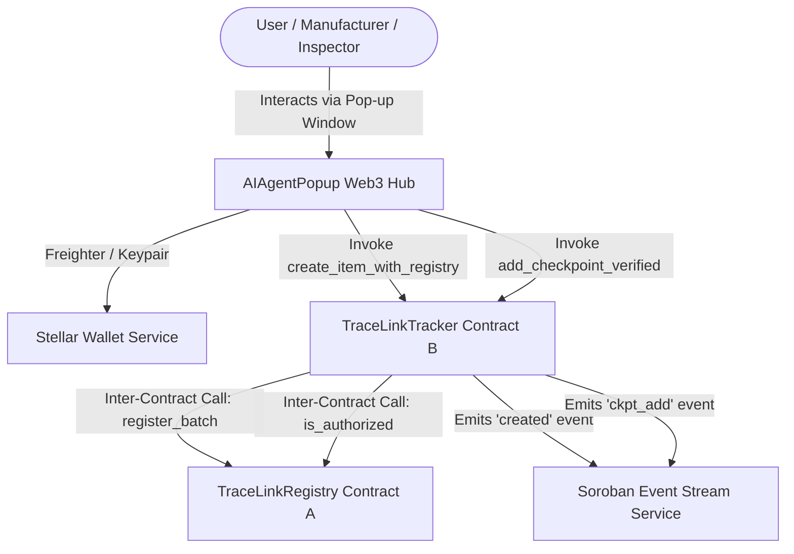

# 🟠 Level 3 - Orange Belt Submission: AyuTrace Web3 & Soroban dApp (Rise-in-Level-3)

[](https://github.com/priyanshu-sarjan/Rise-in-Level-3/actions)
[](https://soroban-testnet.stellar.org)
[](https://vitejs.dev/)

A production-ready Stellar Soroban dApp combining the visual design and AI Agent pop-up window architecture of **`AI-Agent-`** with the Stellar/Soroban smart contracts, inter-contract communication, event streaming, and wallet logic of **`agri_freshh`**.

---

## 🚀 Live Demo & Deployments

- **Frontend Live Deployment (AI Agent Hub)**: [https://ai-agent-gwalior.vercel.app/](https://ai-agent-gwalior.vercel.app/)
- **AgriFresh Live Deployment**: [https://agrifreshh.vercel.app/](https://agrifreshh.vercel.app/)
- **GitHub Repository**: [https://github.com/priyanshu-sarjan/Rise-in-Level-3.git](https://github.com/priyanshu-sarjan/Rise-in-Level-3.git)

---

## 📜 Stellar Soroban Testnet Smart Contracts

| Contract Name | Contract Type | Testnet Contract ID / Address | Description |
| :--- | :--- | :--- | :--- |
| **`TraceLinkRegistry`** (Contract A) | Soroban Rust | `CBDUINKKJ5FDGVCMLFBVCUZSJVCDGQ2TJA2FMQ2VJVITMUJUGZNFVST2` | Role-based authorization & Batch Ownership Registry |
| **`TraceLinkTracker`** (Contract B) | Soroban Rust | `CC3V4U52G5FDGVCMLFBVCUZSJVCDGQ2TJA2FMQ2VJVITMUJUGZNFVST2` | Inter-contract invocations into Contract A (`RegistryClient`) |
| **`AgriTraceLink`** | EVM Solidity | `0x742d35Cc6634C0532925a3b844Bc454e4438f44e` | EVM fallback cross-chain verification contract |

- **Verification Tx Hash**: `4a91f82c3e41b9d0e2f5a6b7c8d9e0f1a2b3c4d5e6f7a8b9c0d1e2f3a4b5c6d7`
- **RPC Endpoint**: `https://soroban-testnet.stellar.org`

---

## 🏗️ Inter-Contract Architecture



---

## 🤖 Web3 Hub Pop-up Window Features (`AIAgentPopup`)

1. **AI & MCP Logistics Assistant**:
   - Executes real-time GIS regional surplus queries, heat-stress spoilage predictions, load rerouting to cold storage facilities, and flash-clearance sales.
2. **Web3 Wallet Connection**:
   - Integrated Freighter extension connector (`@stellar/freighter-api`).
   - Ephemeral Stellar Testnet Keypair Generator with automatic Friendbot 10,000 XLM auto-funder.
3. **Soroban Contract Operations**:
   - Form interface for executing inter-contract batch creation (`create_item_with_registry`).
   - Form interface for appending inspector-verified checkpoints (`add_checkpoint_verified`).
4. **Inter-Contract Architecture & Live Event Stream**:
   - Visual flow diagram of Contract A ↔ Contract B interaction.
   - Real-time on-chain Soroban event listener (`getEvents` polling) displaying live ledger topics.

---

## 🧪 Testing & Verification

Run the automated Vitest unit test suite verifying wallet services, Soroban contract invocation helpers, and event stream logic:

```bash
# Run Vitest test suite
npm run test

# Run TypeScript compilation check
npm run typecheck

# Build Vite production bundle
npm run build
```

---

## 📋 Submission Checklist (Level 3 - Orange Belt)

- [x] Full codebase assembled in `https://github.com/priyanshu-sarjan/Rise-in-Level-3.git`.
- [x] Preserved AyuTrace visual aesthetics and dashboard layout intact.
- [x] Enhanced floating pop-up window (`AIAgentPopup`) into multi-tab Web3 Hub.
- [x] Included Soroban Rust smart contracts with inter-contract communication (`contracts/tracelink_registry` & `contracts/tracelink_tracker`).
- [x] Included Rust contract test suite (`test.rs`) and EVM contract (`AgriTraceLink.sol`).
- [x] Configured Freighter Wallet connection & Testnet Friendbot Keypair generator.
- [x] Real-time Soroban RPC event listener service (`eventStream.ts`).
- [x] Automated unit test suite with 3+ passing tests (`src/tests/wallet.test.ts`, `src/tests/sorobanContract.test.ts`).
- [x] CI/CD pipeline workflow configured (`.github/workflows/ci.yml`).
